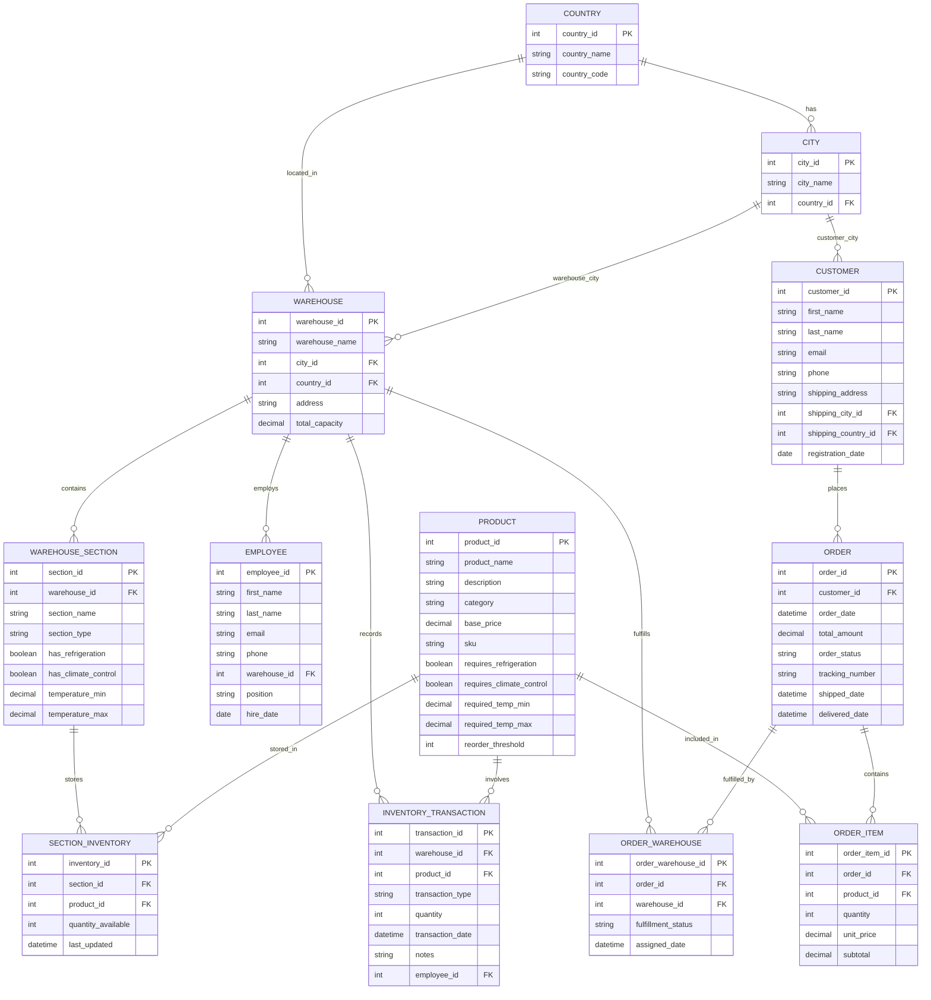

```mermaid
erDiagram
    COUNTRY ||--o{ CITY : "has"
    COUNTRY ||--o{ WAREHOUSE : "located_in"
    COUNTRY {
        int country_id PK
        string country_name
        string country_code
    }

    CITY ||--o{ WAREHOUSE : "warehouse_city"
    CITY ||--o{ CUSTOMER : "customer_city"
    CITY {
        int city_id PK
        string city_name
        int country_id FK
    }

    WAREHOUSE ||--o{ WAREHOUSE_SECTION : "contains"
    WAREHOUSE ||--o{ EMPLOYEE : "employs"
    WAREHOUSE ||--o{ INVENTORY_TRANSACTION : "records"
    WAREHOUSE ||--o{ ORDER_WAREHOUSE : "fulfills"
    WAREHOUSE {
        int warehouse_id PK
        string warehouse_name
        int city_id FK
        int country_id FK
        string address
        decimal total_capacity
    }

    WAREHOUSE_SECTION ||--o{ SECTION_INVENTORY : "stores"
    WAREHOUSE_SECTION {
        int section_id PK
        int warehouse_id FK
        string section_name
        string section_type
        boolean has_refrigeration
        boolean has_climate_control
        decimal temperature_min
        decimal temperature_max
    }

    PRODUCT ||--o{ SECTION_INVENTORY : "stored_in"
    PRODUCT ||--o{ INVENTORY_TRANSACTION : "involves"
    PRODUCT ||--o{ ORDER_ITEM : "included_in"
    PRODUCT {
        int product_id PK
        string product_name
        string description
        string category
        decimal base_price
        string sku
        boolean requires_refrigeration
        boolean requires_climate_control
        decimal required_temp_min
        decimal required_temp_max
        int reorder_threshold
    }

    SECTION_INVENTORY {
        int inventory_id PK
        int section_id FK
        int product_id FK
        int quantity_available
        datetime last_updated
    }

    INVENTORY_TRANSACTION {
        int transaction_id PK
        int warehouse_id FK
        int product_id FK
        string transaction_type
        int quantity
        datetime transaction_date
        string notes
        int employee_id FK
    }

    EMPLOYEE {
        int employee_id PK
        string first_name
        string last_name
        string email
        string phone
        int warehouse_id FK
        string position
        date hire_date
    }

    CUSTOMER ||--o{ ORDER : "places"
    CUSTOMER {
        int customer_id PK
        string first_name
        string last_name
        string email
        string phone
        string shipping_address
        int shipping_city_id FK
        int shipping_country_id FK
        date registration_date
    }

    ORDER ||--o{ ORDER_ITEM : "contains"
    ORDER ||--o{ ORDER_WAREHOUSE : "fulfilled_by"
    ORDER {
        int order_id PK
        int customer_id FK
        datetime order_date
        decimal total_amount
        string order_status
        string tracking_number
        datetime shipped_date
        datetime delivered_date
    }

    ORDER_ITEM {
        int order_item_id PK
        int order_id FK
        int product_id FK
        int quantity
        decimal unit_price
        decimal subtotal
    }

    ORDER_WAREHOUSE {
        int order_warehouse_id PK
        int order_id FK
        int warehouse_id FK
        string fulfillment_status
        datetime assigned_date
    }
```