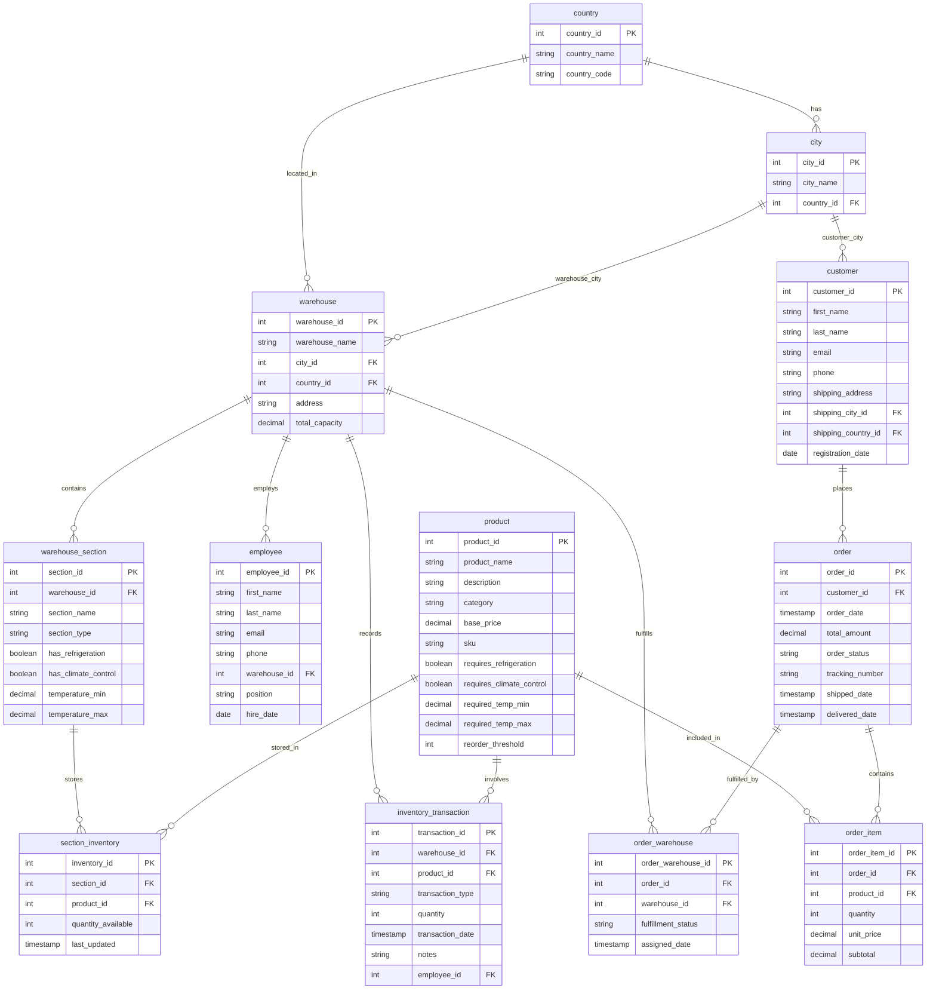

```mermaid
erDiagram
    country ||--o{ city : "has"
    country ||--o{ warehouse : "located_in"
    country {
        int country_id PK
        string country_name
        string country_code
    }

    city ||--o{ warehouse : "warehouse_city"
    city ||--o{ customer : "customer_city"
    city {
        int city_id PK
        string city_name
        int country_id FK
    }

    warehouse ||--o{ warehouse_section : "contains"
    warehouse ||--o{ employee : "employs"
    warehouse ||--o{ inventory_transaction : "records"
    warehouse ||--o{ order_warehouse : "fulfills"
    warehouse {
        int warehouse_id PK
        string warehouse_name
        int city_id FK
        int country_id FK
        string address
        decimal total_capacity
    }

    warehouse_section ||--o{ section_inventory : "stores"
    warehouse_section {
        int section_id PK
        int warehouse_id FK
        string section_name
        string section_type
        boolean has_refrigeration
        boolean has_climate_control
        decimal temperature_min
        decimal temperature_max
    }

    product ||--o{ section_inventory : "stored_in"
    product ||--o{ inventory_transaction : "involves"
    product ||--o{ order_item : "included_in"
    product {
        int product_id PK
        string product_name
        string description
        string category
        decimal base_price
        string sku
        boolean requires_refrigeration
        boolean requires_climate_control
        decimal required_temp_min
        decimal required_temp_max
        int reorder_threshold
    }

    section_inventory {
        int inventory_id PK
        int section_id FK
        int product_id FK
        int quantity_available
        timestamp last_updated
    }

    inventory_transaction {
        int transaction_id PK
        int warehouse_id FK
        int product_id FK
        string transaction_type
        int quantity
        timestamp transaction_date
        string notes
        int employee_id FK
    }

    employee {
        int employee_id PK
        string first_name
        string last_name
        string email
        string phone
        int warehouse_id FK
        string position
        date hire_date
    }

    customer ||--o{ order : "places"
    customer {
        int customer_id PK
        string first_name
        string last_name
        string email
        string phone
        string shipping_address
        int shipping_city_id FK
        int shipping_country_id FK
        date registration_date
    }

    order ||--o{ order_item : "contains"
    order ||--o{ order_warehouse : "fulfilled_by"
    order {
        int order_id PK
        int customer_id FK
        timestamp order_date
        decimal total_amount
        string order_status
        string tracking_number
        timestamp shipped_date
        timestamp delivered_date
    }

    order_item {
        int order_item_id PK
        int order_id FK
        int product_id FK
        int quantity
        decimal unit_price
        decimal subtotal
    }

    order_warehouse {
        int order_warehouse_id PK
        int order_id FK
        int warehouse_id FK
        string fulfillment_status
        timestamp assigned_date
    }
```